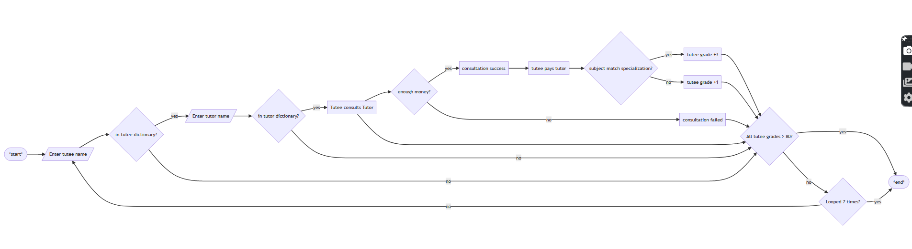
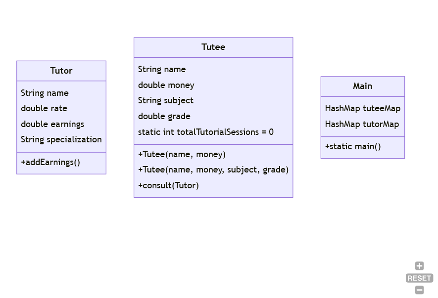

# CS4_Q1_Week7_LongTest

## Learning Objective

* Use previous materials, exercises, or the internet but please DO NOT give or receive help or information to or from anyone other than your teacher or groupmates. 
* Consult your teacher in class for any clarifications regarding the instructions or any problems encountered. 

## Task

A Tutee who needs to improve in a subject is able to hire a Tutor that specializes in that subject. If the condition of the needs of the Tutee matches the specialization of the Tutor, the Tutee's grade is raised by 3. Otherwise, it is only raised by 1.


## Flowchart



### Sample run 1

```
TUTOR APP


Enter name of tutee: 
NAME 		 SUBJECT 		 GRADE
 - Matthew 		 Math 		 70.0
 - John 		 English 		 75.0
Dave
No Tutee named Dave is listed.

Enter name of tutee: 
NAME 		 SUBJECT 		 GRADE
 - Matthew 		 Math 		 70.0
 - John 		 English 		 75.0
Julia
No Tutee named Julia is listed.

Enter name of tutee: 
NAME 		 SUBJECT 		 GRADE
 - Matthew 		 Math 		 70.0
 - John 		 English 		 75.0
Matthew
Enter name of tutor: 
NAME 		 SPECIALIZATION
 - Aaron 		 Math
 - Danica 		 Math
 - Gerson 		 English
Aaron
Aaron helped Matthew make great progress in Math.
Matthew now has a grade of 73.0.
Matthew now has 500.0 pesos left

Enter name of tutee: 
NAME 		 SUBJECT 		 GRADE
 - Matthew 		 Math 		 73.0
 - John 		 English 		 75.0
Matthew
Enter name of tutor: 
NAME 		 SPECIALIZATION
 - Aaron 		 Math
 - Danica 		 Math
 - Gerson 		 English
Gerson
Matthew doesn't have enough money to have a consultation with Gerson.

Enter name of tutee: 
NAME 		 SUBJECT 		 GRADE
 - Matthew 		 Math 		 73.0
 - John 		 English 		 75.0
John
Enter name of tutor: 
NAME 		 SPECIALIZATION
 - Aaron 		 Math
 - Danica 		 Math
 - Gerson 		 English
Aaron
Aaron helped John a little.

Enter name of tutee: 
NAME 		 SUBJECT 		 GRADE
 - Matthew 		 Math 		 73.0
 - John 		 English 		 76.0
John
Enter name of tutor: 
NAME 		 SPECIALIZATION
 - Aaron 		 Math
 - Danica 		 Math
 - Gerson 		 English
Gerson
Gerson helped John make great progress in English.
John now has a grade of 79.0.
John now has 900.0 pesos left

Enter name of tutee: 
NAME 		 SUBJECT 		 GRADE
 - Matthew 		 Math 		 73.0
 - John 		 English 		 79.0
Matthew
Enter name of tutor: 
NAME 		 SPECIALIZATION
 - Aaron 		 Math
 - Danica 		 Math
 - Gerson 		 English
Roy
No tutor named Roy is listed.

3 consultations occurred.
```

### Sample run 2

```
TUTOR APP


Enter name of tutee: 
NAME 		 SUBJECT 		 GRADE
 - Matthew 		 Math 		 70.0
 - John 		 English 		 75.0
Matthew

Enter name of tutor: 
NAME 		 SPECIALIZATION
 - Aaron 		 Math
 - Danica 		 Math
 - Gerson 		 English
Danica
Danica helped Matthew make great progress in Math.
Matthew now has a grade of 73.0.
Matthew now has 800.0 pesos left

Enter name of tutee: 
NAME 		 SUBJECT 		 GRADE
 - Matthew 		 Math 		 73.0
 - John 		 English 		 75.0
Matthew

Enter name of tutor: 
NAME 		 SPECIALIZATION
 - Aaron 		 Math
 - Danica 		 Math
 - Gerson 		 English
Danica
Danica helped Matthew make great progress in Math.
Matthew now has a grade of 76.0.
Matthew now has 600.0 pesos left

Enter name of tutee: 
NAME 		 SUBJECT 		 GRADE
 - Matthew 		 Math 		 76.0
 - John 		 English 		 75.0
Matthew

Enter name of tutor: 
NAME 		 SPECIALIZATION
 - Aaron 		 Math
 - Danica 		 Math
 - Gerson 		 English
Danica
Danica helped Matthew make great progress in Math.
Matthew now has a grade of 79.0.
Matthew now has 400.0 pesos left

Enter name of tutee: 
NAME 		 SUBJECT 		 GRADE
 - Matthew 		 Math 		 79.0
 - John 		 English 		 75.0
Matthew

Enter name of tutor: 
NAME 		 SPECIALIZATION
 - Aaron 		 Math
 - Danica 		 Math
 - Gerson 		 English
Danica
Danica helped Matthew make great progress in Math.
Matthew now has a grade of 82.0.
Matthew now has 200.0 pesos left

Enter name of tutee: 
NAME 		 SUBJECT 		 GRADE
 - Matthew 		 Math 		 82.0
 - John 		 English 		 75.0
John

Enter name of tutor: 
NAME 		 SPECIALIZATION
 - Aaron 		 Math
 - Danica 		 Math
 - Gerson 		 English
Gerson
Gerson helped John make great progress in English.
John now has a grade of 78.0.
John now has 1400.0 pesos left


Enter name of tutee: 
NAME 		 SUBJECT 		 GRADE
 - Matthew 		 Math 		 82.0
 - John 		 English 		 78.0
John

Enter name of tutor: 
NAME 		 SPECIALIZATION
 - Aaron 		 Math
 - Danica 		 Math
 - Gerson 		 English
Gerson
Gerson helped John make great progress in English.
John now has a grade of 81.0.
John now has 800.0 pesos left


6 consultations occurred.
```


## Procedure

1. Form a group of 2-3 students
1. Open a Java REPL 
2. Copy-Paste the Code Template
3. Run the code to see if it runs
4. Edit the code so that the output matches the sample run as close as possible
5. Run the code in the corresponding VPL activity for evaluation
6. Adjust your code until you get a happy score before the deadline passes
7. Have your teacher look at your work and ask individual questions about the code
8. Sign your score sheet and give it to your teacher. :)


 
### Create a Tutor class 
 Give the Tutor class fields for name (String), rate (double), earnings (double), specialization (String).
 Make a constructor for the Tutor class that has parameters for name, rate and specialization, and sets the earnings to 0.
 
 Write the following methods:
 
- getter/accessor methods for relevant fields 
- addEarnings(): adds the rate to the earnings 


### Debug the Tutee class
 Give the Tutee class fields for name (String), money (double), subject (String), grade (double), and totalTutorialSessions (int, static, set to 0).
 
 Make 2 constructors for the Tutee class that
 
- has parameters for the name, money, and sets the subject to "Math" and grade to 70 
- has parameters for the name, money, subject, and grade 

 Write the following methods:
 
- appropriate getter/accessor methods for the fields 
- consult(Tutor t): 


Given a Tutor, check the rate and if the Tutee has enough money, the consultation proceeds. 

> Print "<Tutee's name> doesn't have enough money to have a consultation with <tutor    's name>." if Tutee doesn't have enough money 

> the money of the Tutee is reduced by the rate of the Tutor and added to the Tutor's earnings and the totalTutorialSessions is increased by 1 
 
> if the Tutor's specialization is the same as the Tutee's subject, the Tutee's grade is increased by 3. It is increased by 1 otherwise. 

 > Print "<tutor's name> helped <Tutee's name> a little." if specialization doesn't match condition 

> Print "<tutor's name> helped <Tutee's name> make great progress in <Tutee's subject>." if specialization matches condition 

### Write main method 
 
 1. Create a Tutee s1 with name "Matthew" and 1000 money. 
 2. Create a Tutee s2 with name "John", 2000 money, subject "English", and grade 75 
 3. Create a Tutor t1 with name "Aaron", rate 500, and "Math" specialization 
 4. Create a Tutor t2 with name "Danica", rate 200, and "Math" specialization 
 5. Create a Tutor t3 with name "Gerson", rate 600, and "English" specialization 
 6. Create an HashMap of Tutee tuteeMap and put (s1.name, s1) and (s2.name, s2) 
 7. Create an HashMap of Tutors tutorMap and put (t1.name, t1), (t2.name, t2), and (t3.name, t3). 
 8.  Write a loop that ends when all Tutees have a grade higher than 80 or the loop has run 7 times 

 Inside the loop:

- Ask the user which Tutee will be selected 
	>Print "No Tutee named <input> is listed." if user input doesn't match 

- Ask the user which tutor will be hired by the Tutee 
	>Print "No tutor named <input> is listed." if user input doesn't match 
	
- Selected Tutee consults with selected tutor using the information given.   
 When the loop ends, display the number of consultations that occurred 


### Class diagrams



## Code Template

Use 3 files:

1. Tutee.java
2. Tutor.java
3. Main.java

### Tutee.java

```java


/////// CHANGE ANY PART OF THIS CODE TO SOLVE THE PROBLEM 

public class Tutee {
  private final String name, subject;
  private double money, grade;
  private static int totalTutorialSessions = 0;

  public Tutee(String n, double m) {
    name = n;
    money = m;
    subject = "Math";
  }

  public Tutee(String n, double m, String s, double g) {
    name = n;
    money = m;
    subject = s;
    grade = g;
  }

  public String getName() {
    return name;
  }

  public String getSubject() {
    return subject;
  }

  public double getMoney() {
    return money;
  }

  public double getGrade() {
    return grade;
  }

  public int getTotalTutorialSessions() {
    return totalTutorialSessions;
  }

  public boolean consult(Tutor t) {
    if (money >= t.rate) {
      return true;
    } else {
      return false;
    }
  }
}
```

### Tutor.java

```java


/////// CHANGE ANY PART OF THIS CODE TO SOLVE THE PROBLEM 

public class Tutor {

        double rate;
        double earnings;
        String specialization;
        String name;
        
        public Tutor(String n, double r, String s){
            name = n;
            rate = r;
            specialization = s;

        }
        

}
```

### Main.java

```java

// package cs4q1w7tutor;
import java.util.HashMap;
import java.util.Scanner;

/**
 *
 * @author roy
 */
public class Main {


    /////// CHANGE ANY PART OF THIS CODE TO SOLVE THE PROBLEM 


  public static void main(String[] args) {
      
    Scanner input = new Scanner(System.in);  
    System.out.println("\n\nTUTOR APP\n");
    
    Tutee s1 = new Tutee("Matthew", 1000);
    Tutee s2 = new Tutee("John", 2000, "English", 75);
    Tutor t1 = new Tutor("Aaron",500, "Math");
    Tutor t2 = new Tutor("Danica", 200, "Math");
    Tutor t3 = new Tutor("Gerson", 600, "English" );

    HashMap<String, Tutee> tuteeMap = new HashMap<>();
    tuteeMap.put(s1.getName(), s1);
    tuteeMap.put(s2.getName(), s2);    
    
    HashMap<String, Tutor> tutorMap = new HashMap<>();
    tutorMap.put(t1.name, t1);
    tutorMap.put(t2.name, t2);
    tutorMap.put(t3.name, t3);
    
    int consultCount = 0;
    
    for(int i=0; i<7; i++){

        // list tutees
        System.out.println("\nEnter name of tutee: ");
        
        System.out.println("NAME \t\t SUBJECT \t\t GRADE");
        for(var t : tuteeMap.values()){
          System.out.printf(" - %s \t\t %s \t\t %S\n", t.getName(), t.getSubject(), t.getGrade());
            
        }
        String tuteeName = input.nextLine();
        if(tuteeMap.containsKey(tuteeName)){
            
            System.out.println("\nEnter name of tutor: ");

        }
        else{
            System.out.printf("No Tutee named %s is listed.\n", tuteeName);
        }
        
    }
    
    System.out.printf("\n\n%d consultations occurred.\n\n", consultCount);
            
  }
}
    
```

## Assessment Criteria

Your code's grade is dependent on your presentation to the teacher during class hours.

*  Tutor class [10pts]
*  Tutee class [20pts]
*  Main class [20pts]
*  Individual Oral Exam [15pts]

## Due Date 

Please submit this on or before the assigned due date (before exam week).
